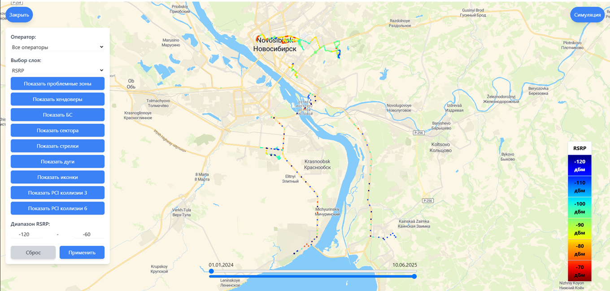
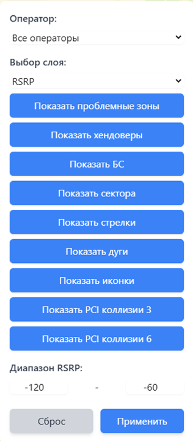
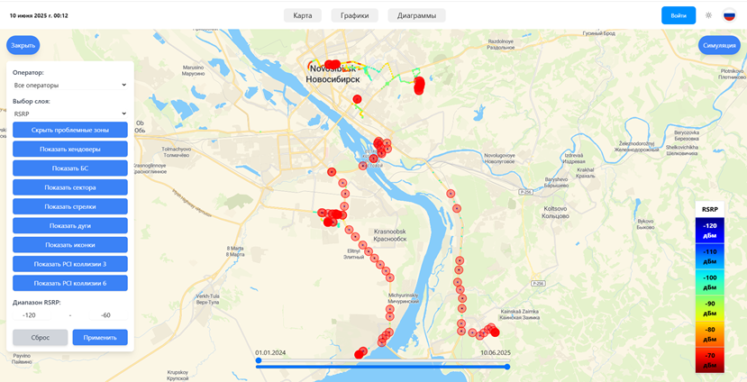
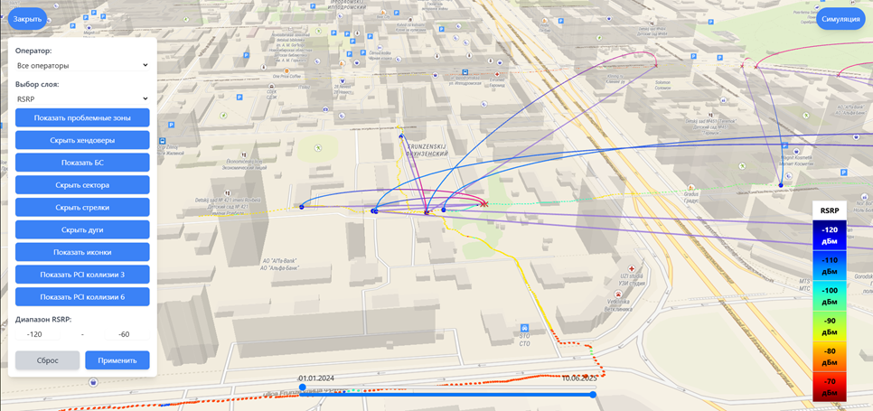
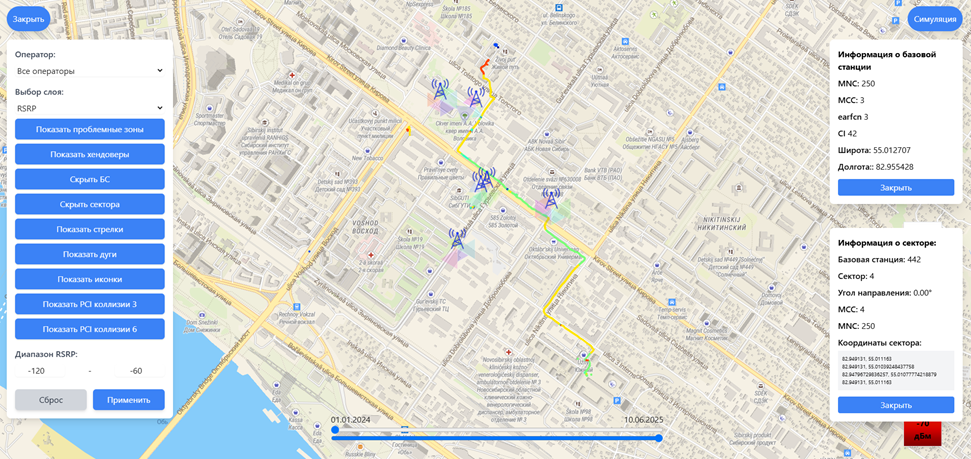
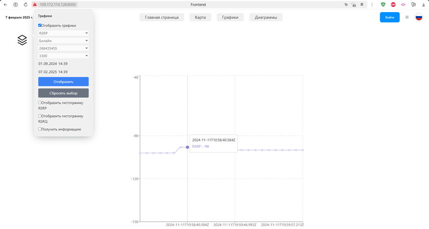
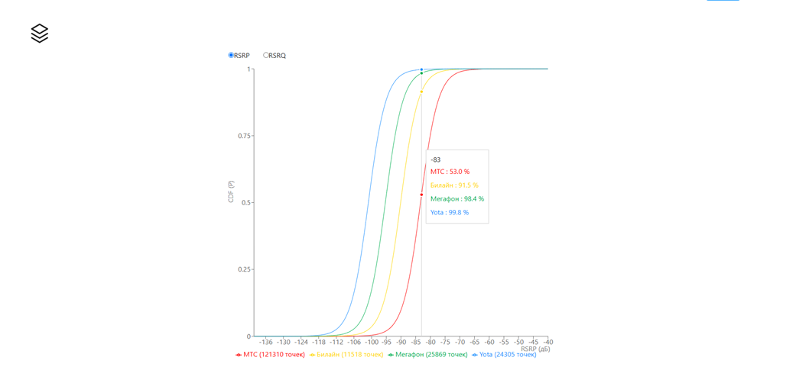

# 📡 Веб-приложение для визуализации сетевых характеристик мобильного устройства (Drive Test)

Это веб-интерфейс для отображения **радиопокрытия**, **качества сигнала**, **проблемных зон**, **хэндоверов** и других сетевых параметров, собранных с мобильного устройства в реальном времени.

---

## 🚀 Как работает система?

### 🔹 1. Установите мобильное приложение

👉 [Скачать приложение для Android](https://github.com/vladimir-ponomarenko/Android/releases/tag/v2.3.2)

### 🔹 2. Запустите сбор данных

- Откройте приложение.
- Включите сбор в фоновом режиме — данные будут автоматически отправляться на сервер.

### 🔹 3. Визуализируйте данные

📍 После успешной загрузки вы сможете просматривать данные в веб-интерфейсе:  
👉 [Веб-приложение](http://109.172.114.128:8000)

---

## 🧩 Основной функционал

### 📶 Отображение RSRP/RSRQ на карте

- Снизу доступен временной фильтр
- Справа — легенда значений



---

### 🎚️ Фильтры на карте

- Фильтрация по времени, оператору, RSRP/RSRQ
- Выбор слоя отображения



---

### 🛑 Проблемные зоны

- Участки с плохим качеством сигнала



---

### 🔄 Хэндоверы

- Переключения между сотами отображаются стрелками



---

### 🗼 Базовые станции и секторы

- Видны расположения БС и диаграммы направленности



---

### 📊 Графики по данным

- Диаграммы по сигналу и накопленные функции распределения

  


---

## Getting Started

To get started with GUI, follow these steps:

1. Clone the repository:

   ```
   git clone git@github.com:pneidorf/front_react.git
   ```

2. Change ENV variables:

   ```
   cp .env.example .env
   nano .env
   ```

3. Install dependencies:

   ```
   npm install
   ```

4. Start the development server:

   ```
   npm run dev
   ```

5. Access the application at [http://localhost:5173](http://localhost:5173).
